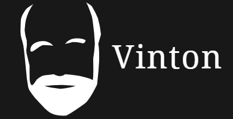

# Vinton

Vinton is a JS projects manager. It runs pluggable checks against your projects workspace and shows a clear health status.

## Installation

    npm install -g vinton

## Plugins

Vinton is build around plugins. It means that you can add any compatible Vinton plugins to your checklist.

If you want to create a new plugin, please follow the examples and tell us about it.

## Usage

    cd /workspace
    vinton

### Commands

#### init

    vinton init

This will create a new empty configuration file.

#### help

    vinton help

Display informations about the CLI and the possible commands.

#### version

    vinton version

Display the current vinton version.

#### add

    vinton add <plugin> <plugin> ...

Install plugins and add them to the configuration file.

alias: `install`

#### remove

    vinton remove <plugin> <plugin> ...

Uninstall plugins and remove them from the configuration file.

alias: `rm`, `uninstall`

## License

[MIT](license)
